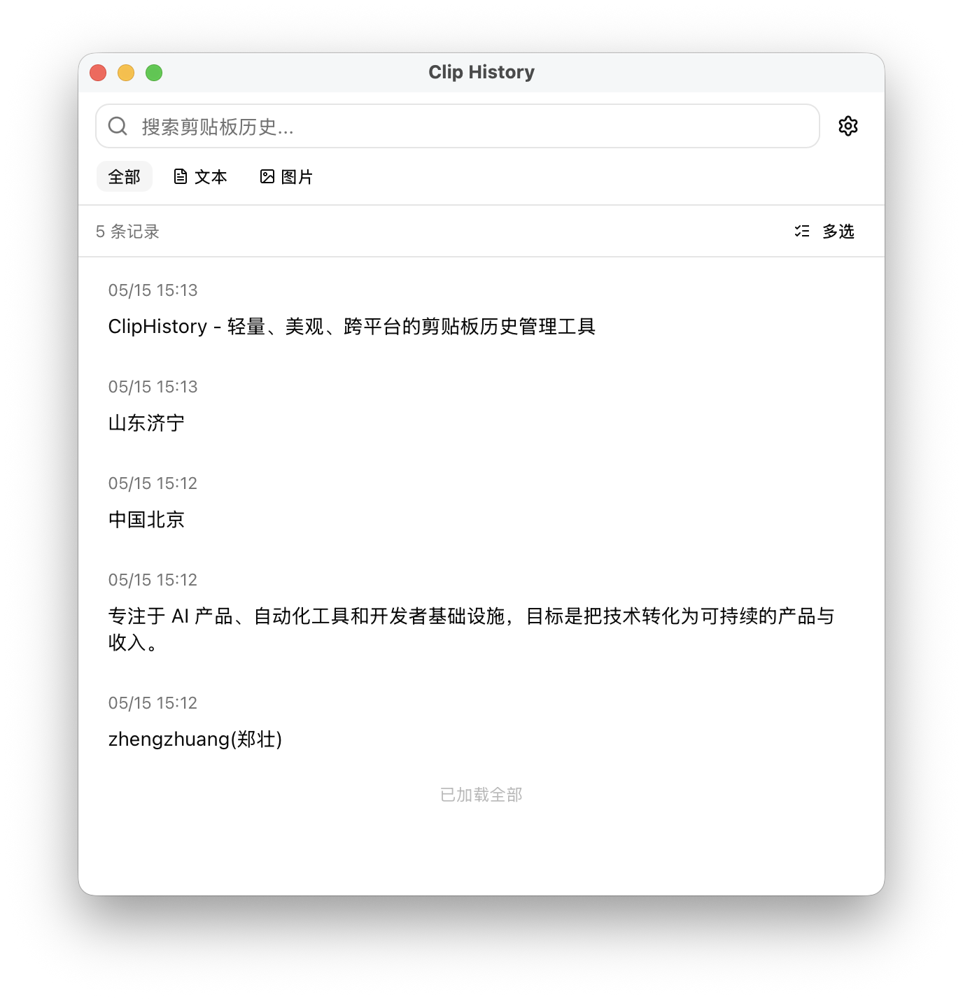
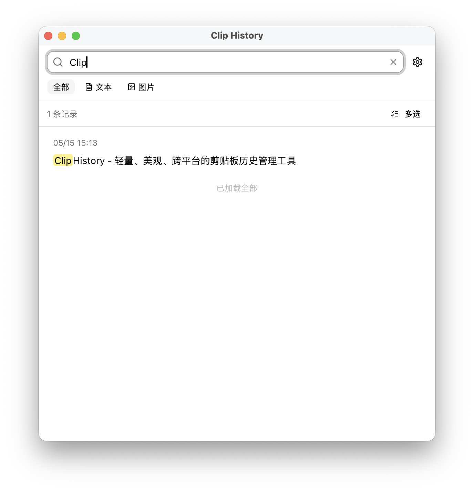
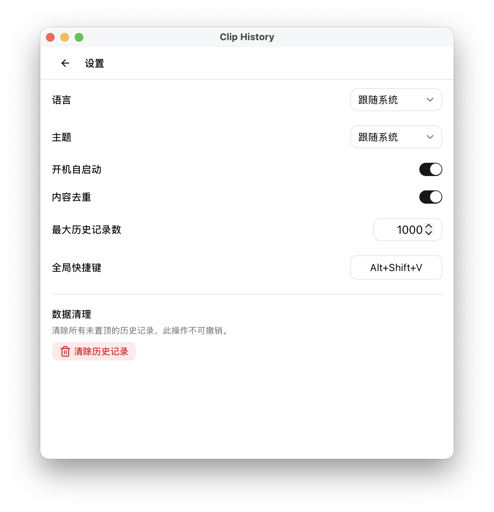

# Clip History

> 轻量、美观、跨平台的剪贴板历史管理工具

Clip History 是一个基于 [Tauri 2](https://v2.tauri.app/) 构建的桌面应用，自动记录你的剪贴板历史，支持文本和图片，让你随时搜索、预览并快速复用之前复制过的内容。

## 特性

- **自动记录** — 后台静默监听剪贴板变化，自动保存历史
- **文本 + 图片** — 完整支持纯文本和图片两种剪贴板内容类型
- **即时搜索** — 输入关键词实时过滤，快速找到目标内容
- **内容预览** — 图片缩略图预览、文本全文预览
- **一键复制** — 点击即可将历史内容重新写入剪贴板
- **全局快捷键** — 任何应用中按下快捷键即可唤起窗口
- **系统托盘** — 最小化到托盘常驻后台，不占任务栏
- **跨平台** — 支持 Windows 10+ 和 macOS 12+
- **轻量高效** — 基于 Tauri + Rust，安装包仅 ~5MB，内存占用低

## 截图

| 主界面 | 搜索 | 设置 |
|--------|------|------|
|  |  |  |

## 安装

### macOS

从 [Releases](../../releases) 下载 `.dmg` 安装包，拖入 Applications 文件夹即可。

> **未签名应用说明**：本应用未进行 Apple 开发者签名，首次打开时 macOS 可能提示"已损坏"或"无法验证开发者"。
>
> 解决方法：打开**终端**，输入 `xattr -cr `（注意后面有个空格），然后将应用程序图标拖入终端窗口，回车即可正常打开。

### Windows

从 [Releases](../../releases) 下载 `.exe` 安装包运行安装。

## 快速上手

1. 启动 Clip History
2. 应用自动在后台监听剪贴板
3. 正常使用复制操作（Ctrl/Cmd + C）
4. 按下 **全局快捷键**（默认 `Alt/Cmd + Shift + V`）唤起历史窗口
5. 浏览、搜索、选择要复用的内容

## 开发

### 环境准备

```bash
# 安装 Rust（国内推荐使用中科大镜像）
export RUSTUP_DIST_SERVER=https://mirrors.ustc.edu.cn/rust-static
export RUSTUP_UPDATE_ROOT=https://mirrors.ustc.edu.cn/rust-static/rustup
curl --proto '=https' --tlsv1.2 -sSf https://sh.rustup.rs | sh

# 安装 Node.js（推荐使用 nvm）
nvm install 18

# 安装 Tauri CLI
cargo install tauri-cli --version "^2"
```

> 国内用户建议将上述 `RUSTUP_DIST_SERVER` 和 `RUSTUP_UPDATE_ROOT` 环境变量写入 `~/.bashrc` 或 `~/.zshrc` 持久生效。同时项目已配置 Cargo 使用中科大 crates 镜像（见 `~/.cargo/config.toml`）。

### 开发模式

```bash
# 克隆项目
git clone https://github.com/zhengzhuangpro/clip-history.git
cd clip-history

# 安装前端依赖
pnpm install

# 启动开发服务器
pnpm tauri dev
```

### 构建

```bash
# 构建生产版本
pnpm tauri build
```

### 项目结构

```
clip-history/
├── src-tauri/        # Rust 后端（剪贴板监听、数据库、系统集成）
├── src/              # React 前端（UI 组件、状态管理）
├── docs/             # 项目文档
└── CLAUDE.md         # 开发规范与决策记录
```

详细的目录结构说明请参阅 [CLAUDE.md](./CLAUDE.md)。

## 技术栈

| 技术 | 用途 |
|------|------|
| Tauri 2 | 桌面应用框架 |
| React + TypeScript | 前端 UI |
| Tailwind CSS + shadcn/ui | 样式与组件 |
| Rust | 后端核心逻辑 |
| SQLite | 本地数据存储 |

## 路线图

详见 [docs/roadmap.md](./docs/roadmap.md)。

## 许可证

MIT License
